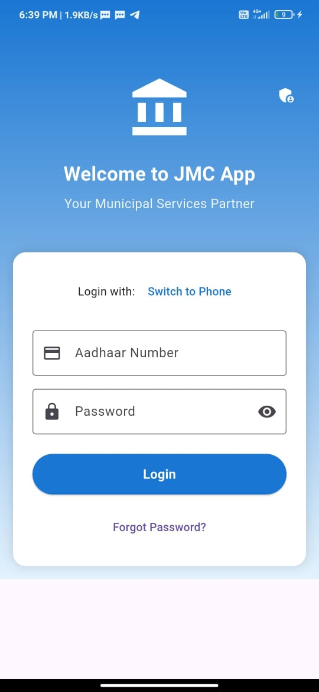
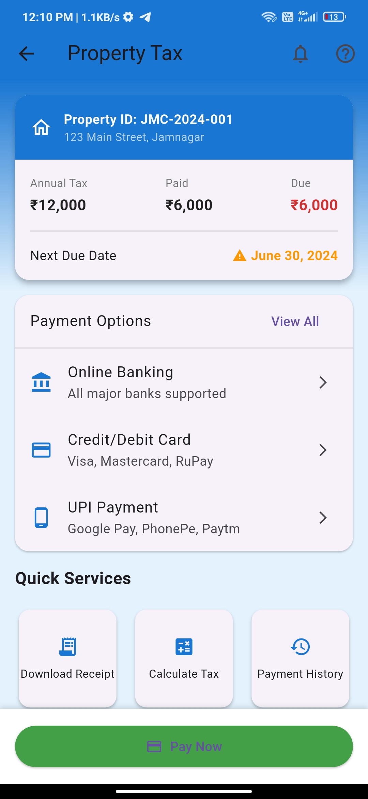
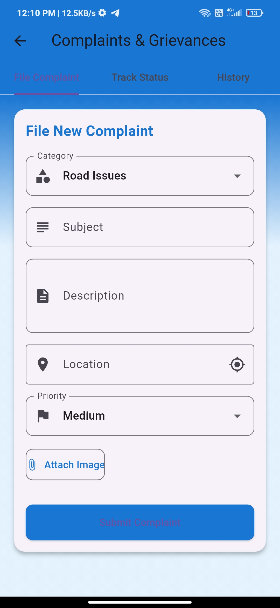
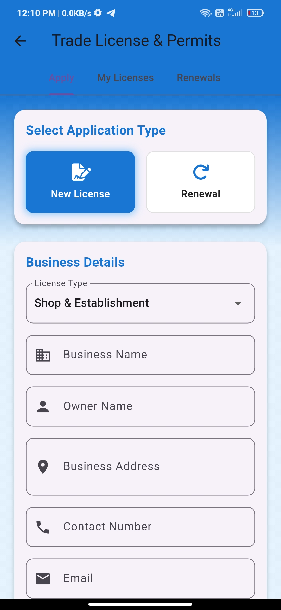
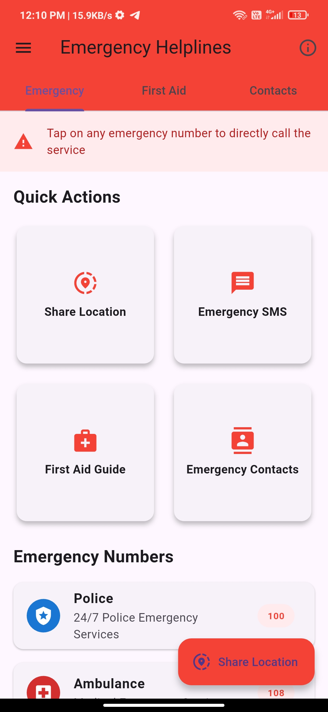
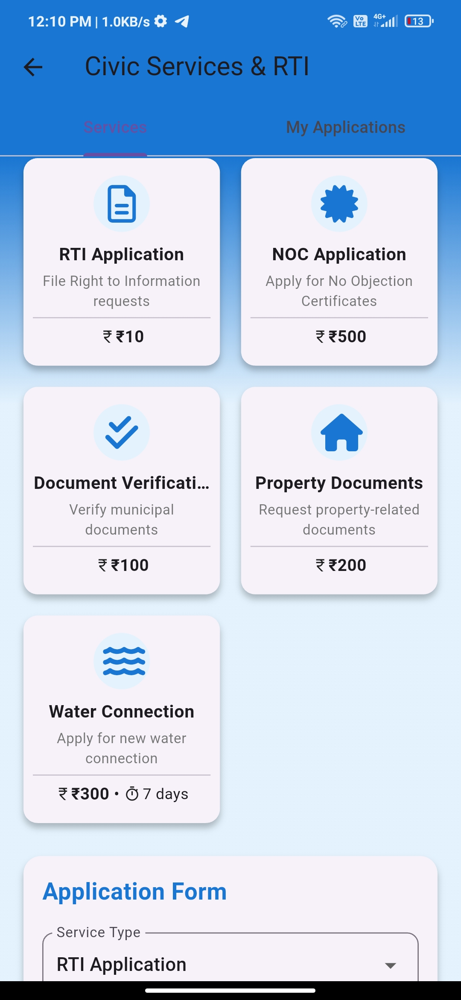
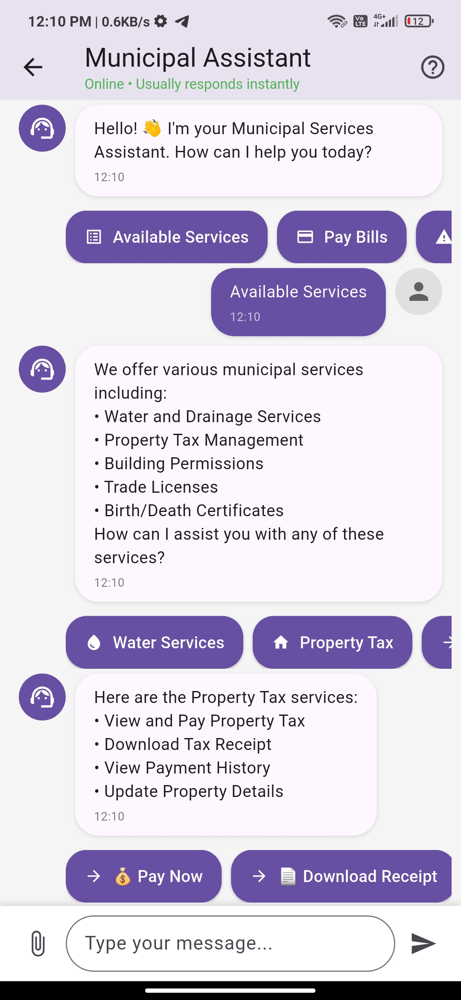

# 🏛️ JMC App - Jamnagar Municipal Corporation

[](https://github.com/PamJoshi/JMC-App/releases/download/v1.0.0/JMC-App.apk)

A modern Flutter-based mobile application for the citizens of Jamnagar to access municipal services digitally.


---

## 📦 Download

You can always get the latest version from the [Releases page](https://github.com/PamJoshi/JMC-App/releases).

---

## 🌟 Features

### 📱 Core Services
- **Civic Services & RTI**
  - File RTI applications
  - Apply for NOC certificates
  - Document verification
  - Property document requests
  - Water connection applications
- **Smart City Services**
  - Property tax payment
  - Birth & death certificates
  - Trade licenses
  - Building permits
- **Other Services**
  - Waste management
  - Street light maintenance
  - Public transport & parking
  - Emergency helplines
  - Events & notices
  - Feedback & surveys

### 🛠️ Key Capabilities
- Secure login via Aadhaar/Phone
- OTP verification
- Profile management
- Real-time application tracking
- Digital document storage
- In-app payments
- Status notifications
- Step-by-step guides

---

## 🚀 Getting Started

### Prerequisites
- Flutter SDK (3.0 or higher)
- Dart SDK (2.17 or higher)
- Android Studio / Xcode
- Git

### Installation

1. Clone the repository
   ```bash
   git clone https://github.com/yourusername/jvmapp.git
   cd jvmapp
   ```
2. Install dependencies
   ```bash
   flutter pub get
   ```
3. Run the app
   ```bash
   flutter run
   ```

---

## 📱 Screenshots

> Add screenshots in a `screenshots/` folder and reference them here for a better showcase!

<table>
  <tr>
    <td></td>
    <td></td>
    <td></td>
    <td></td><br>
    <td></td>
    <td></td>
    <td></td>
    <td></td>
  </tr>
</table>

---

## 🏗️ Architecture

- **Screens**: UI components and widgets
- **Services**: Business logic and API integration
- **Models**: Data structures and state management
- **Utils**: Helper functions and constants

## 🔧 Technical Stack

- **Frontend**: Flutter & Dart
- **State Management**: Provider
- **Storage**: SharedPreferences
- **Network**: Dio
- **Authentication**: Custom Auth Service

---

## 🤝 Contributing

1. Fork the repository
2. Create a new branch (`git checkout -b feature/amazing-feature`)
3. Commit your changes (`git commit -m 'Add amazing feature'`)
4. Push to the branch (`git push origin feature/amazing-feature`)
5. Open a Pull Request

---

## 📄 License

This project is licensed under the MIT License - see the [LICENSE](LICENSE) file for details.

## 👥 Team

- Product Owner: Param Joshi
- Developed By: Param Joshi


---

<p align="center">Made with ❤️ for the citizens of Jamnagar</p>
